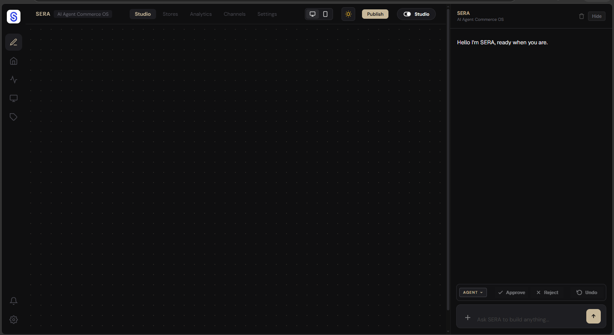
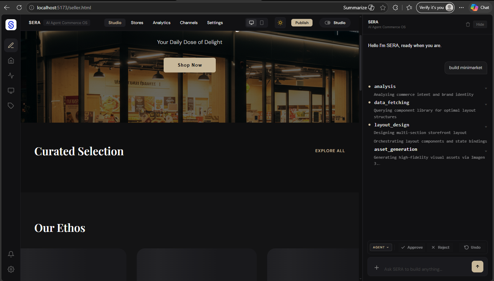
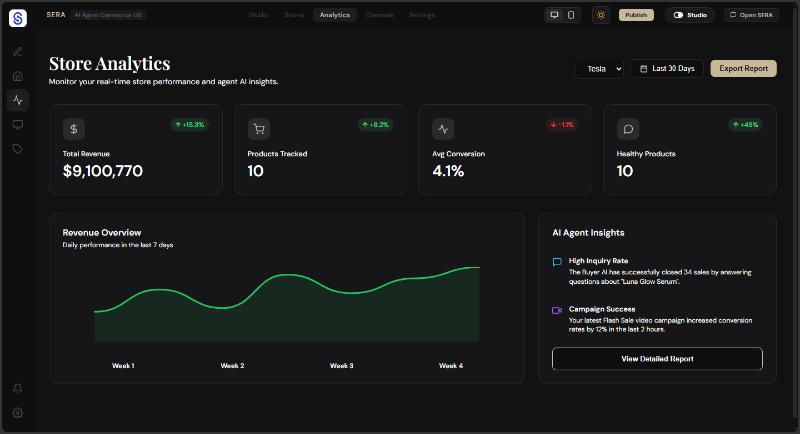
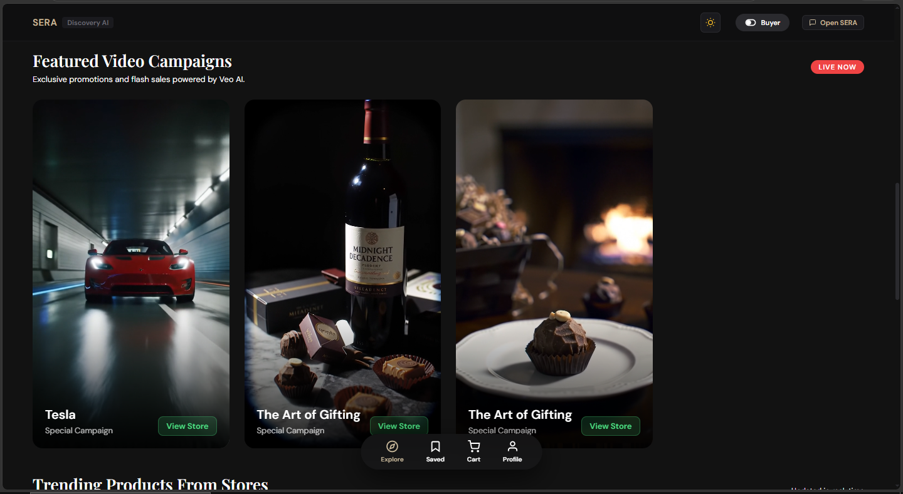
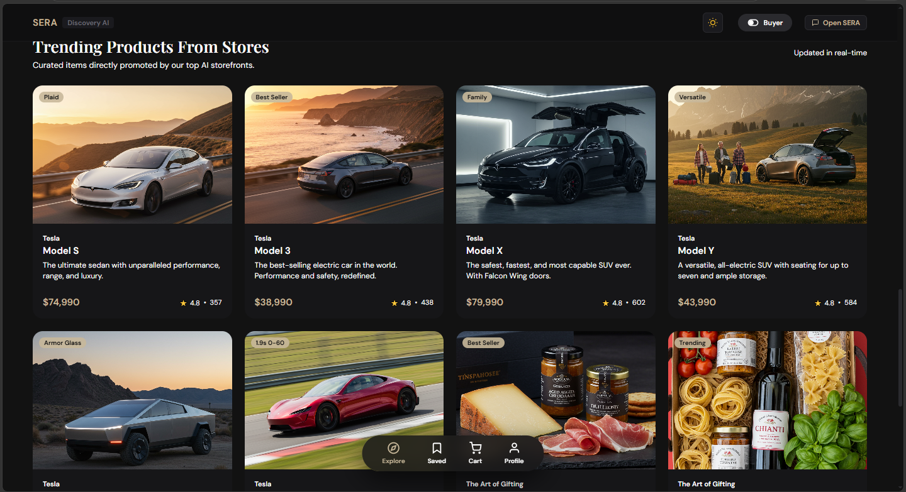
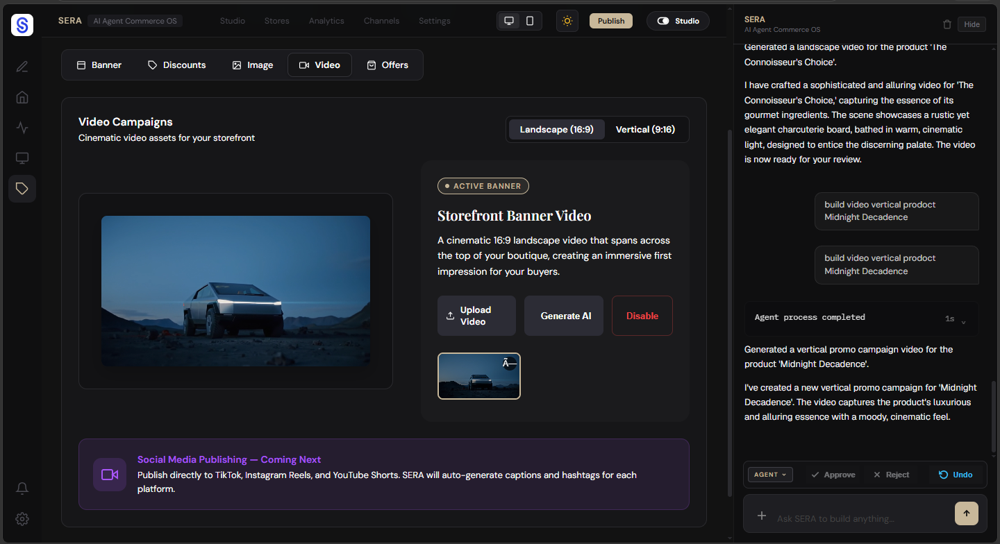

# SERA Autonomous Commerce Operating System

<p align="center">
  
</p>

<h3 align="center">
Build, Manage, and Grow a Business Through Conversation
</h3>

<p align="center">
Powered by Gemini 2.5 Pro · Gemini 2.5 Flash · Imagen 3 · Veo · Google ADK · MongoDB MCP · Cloud Run
</p>

<p align="center">
🏆 Built for Google Cloud Hackathon 2026
</p>

---

# The Problem

Starting an online business is still too complicated.

Entrepreneurs often need to learn and manage multiple platforms for:

* Store creation
* Branding
* Product management
* Analytics
* Marketing
* Content production
* Customer engagement

While AI assistants can provide suggestions, they rarely execute real business workflows.

As a result, merchants spend more time managing tools than growing their business.

---

# Our Vision

We believe anyone should be able to start and operate a business simply by describing what they want.

Instead of navigating complex software, users should be able to say:

> "Create a coffee brand for students."

or

> "Analyze my store and tell me how to increase sales."

and have an autonomous system handle the rest.

---

# What is SERA?

**SERA (Smart Ecommerce Reasoning Agent)** is an AI-native commerce operating system that enables merchants to create, operate, analyze, and grow digital businesses through natural language.

SERA combines reasoning, analytics, content generation, and autonomous workflows into a single commerce platform.

> "You describe. SERA builds. AI sells."

---

# Two-Sided Commerce Platform

SERA consists of two connected experiences.

## 🏪 Seller Mode

An AI workspace for merchants.

Merchants can:

* Create stores from a conversation
* Generate products automatically
* Build branding and identity
* Analyze performance
* Create marketing campaigns
* Generate images and videos
* Receive business recommendations

The merchant focuses on goals.

SERA handles execution.

---

## 🛍️ Buyer Mode

An AI-powered shopping experience.

Buyers can:

* Discover stores
* Explore products
* Search naturally using conversation
* Receive product recommendations
* Interact with an AI shopping assistant

Instead of searching through filters, buyers simply describe what they need.

---

# Autonomous Multi-Agent Architecture

SERA is powered by multiple specialized agents built with Google Agent Development Kit (ADK).

Each agent is responsible for a specific commerce function.

| Agent                   | Responsibility                                                            |
| ----------------------- | ------------------------------------------------------------------------- |
| Store Architect Agent   | Creates storefronts, products, branding, and business identity            |
| Commerce Strategy Agent | Business planning and growth recommendations                              |
| Analytics Agent         | Revenue analysis and operational intelligence                             |
| Marketing Agent         | Campaign generation and positioning strategies                            |
| Image Generation Agent  | Creates banners, product visuals, and promotional graphics using Imagen 3 |
| Video Generation Agent  | Produces marketing videos using Veo                                       |
| Buyer Assistant Agent   | Conversational shopping and product discovery                             |

This architecture enables SERA to operate as an autonomous commerce system rather than a traditional chatbot.

---

# Intelligent AI Routing

Different business tasks require different AI capabilities.

SERA dynamically routes workloads to specialized models.

## 🧠 Gemini 2.5 Pro

Used for:

* Store creation
* Product generation
* Strategic planning
* Deep reasoning
* Business analysis
* Agent orchestration

---

## ⚡ Gemini 2.5 Flash

Used for:

* Buyer conversations
* Product discovery
* Fast interactions
* Real-time assistance

---

## 🖼️ Imagen 3

Used for:

* Product images
* Store branding
* Marketing graphics
* Promotional assets
* Hero banners

---

## 🎬 Veo

Used for:

* Promotional videos
* Product showcases
* Social media reels
* Campaign content
* Marketing videos

---

# Commerce Intelligence with MongoDB MCP

One of SERA's core innovations is its integration with MongoDB Atlas through the Model Context Protocol (MCP).

Instead of relying on static context, SERA can access real business data directly.

Supported operations include:

* find
* aggregate
* insertOne
* updateOne

This enables agents to analyze:

* Revenue
* Orders
* Product performance
* Customer activity
* Store growth trends

The result is AI-generated business intelligence based on live operational data.

---

# System Architecture

```text
┌──────────────────────────────────────┐
│           React Frontend             │
│                                      │
│  Seller Mode      +     Buyer Mode   │
└───────────────────┬──────────────────┘
                    │
                    ▼

┌──────────────────────────────────────┐
│          Node.js Backend             │
│          API Gateway Layer           │
└───────────────────┬──────────────────┘
                    │
                    ▼

┌──────────────────────────────────────┐
│      Google ADK Agent Runtime        │
│             (Python)                 │
└───────┬────────────┬────────────┬────┘
        │            │            │
        ▼            ▼            ▼

┌─────────────┐ ┌─────────────┐ ┌─────────────┐
│ Gemini 2.5  │ │ Imagen 3    │ │ Veo         │
│ Pro / Flash │ │ Image Gen   │ │ Video Gen   │
└─────────────┘ └─────────────┘ └─────────────┘

        │
        ▼

┌──────────────────────────────────────┐
│      MongoDB Atlas + MCP Server      │
└──────────────────────────────────────┘
```

---

# Google Cloud Implementation

SERA leverages Google Cloud technologies to power autonomous commerce workflows.

### Google Cloud Services

* Vertex AI
* Gemini 2.5 Pro
* Gemini 2.5 Flash
* Imagen 3
* Veo
* Google Agent Development Kit (ADK)
* Cloud Run
* Cloud Logging
* Cloud Monitoring

### Cloud Deployment

Production services are deployed on Cloud Run.

Cloud Run hosts:

* Node.js Backend
* Python Agent Runtime
* Agent APIs

This architecture enables scalable and serverless AI execution.

---

# Technology Stack

| Layer                  | Technology          |
| ---------------------- | ------------------- |
| Frontend               | React + Vite        |
| Backend                | Node.js + Express   |
| Agent Runtime          | Python + Google ADK |
| Strategic Reasoning    | Gemini 2.5 Pro      |
| Realtime Commerce Chat | Gemini 2.5 Flash    |
| Image Generation       | Imagen 3            |
| Video Generation       | Veo                 |
| Database               | MongoDB Atlas       |
| AI Data Access         | MongoDB MCP         |
| Deployment             | Google Cloud Run    |

---

# Potential Impact

SERA lowers the barrier to entrepreneurship.

By transforming commerce operations into natural language interactions, SERA empowers:

* Small businesses
* Independent creators
* Students
* First-time entrepreneurs
* Emerging market sellers

A single individual can launch, manage, and grow a digital business without requiring technical expertise.

Our long-term vision is to democratize commerce through autonomous AI.

---

# Screenshots

### Seller Workspace



### AI Store Creation



### Analytics Dashboard



### Buyer Discovery Feed



### Imagen 3 Content Generation



### Veo Video Generation



---

# Demo Video

YouTube Demo:

[](https://youtu.be/BP1vJ2zTqHo)

---

# Getting Started

## Clone Repository

```bash
git clone https://github.com/seraos-agent/sera-commerce-agent.git
cd sera-commerce-agent
```

## Frontend

```bash
npm install
npm run dev
```

## Backend

```bash
cd server
npm install
node index.js
```

## Agent Runtime

```bash
cd sera-agent-python
pip install -r requirements.txt
uvicorn main:app --host 0.0.0.0 --port 8000 --reload
```

## Environment Variables

Each service requires a `.env` file. Copy the `.env.example` in each directory and fill in the values.

| File | Key Variables |
|---|---|
| `.env` | `VITE_BACKEND_URL`, `VITE_ADK_URL` |
| `server/.env` | `MONGODB_URI`, `PORT` |
| `sera-agent-python/.env` | `GOOGLE_CLOUD_PROJECT`, `GOOGLE_CLOUD_LOCATION`, `GOOGLE_GENAI_USE_VERTEXAI` |

---

# Future Vision

SERA is evolving toward a fully autonomous commerce operating system.

Future capabilities include:

* Autonomous marketing execution
* Multi-channel commerce automation
* Marketplace integrations
* Social commerce workflows
* Advanced multi-agent collaboration
* AI-powered business operations at scale

---

# License

MIT License
